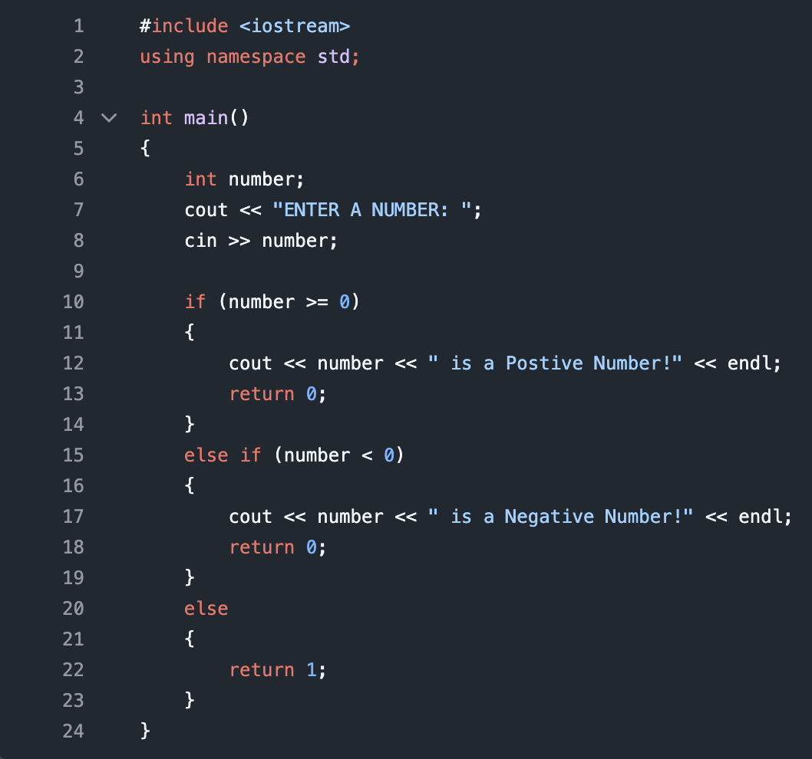
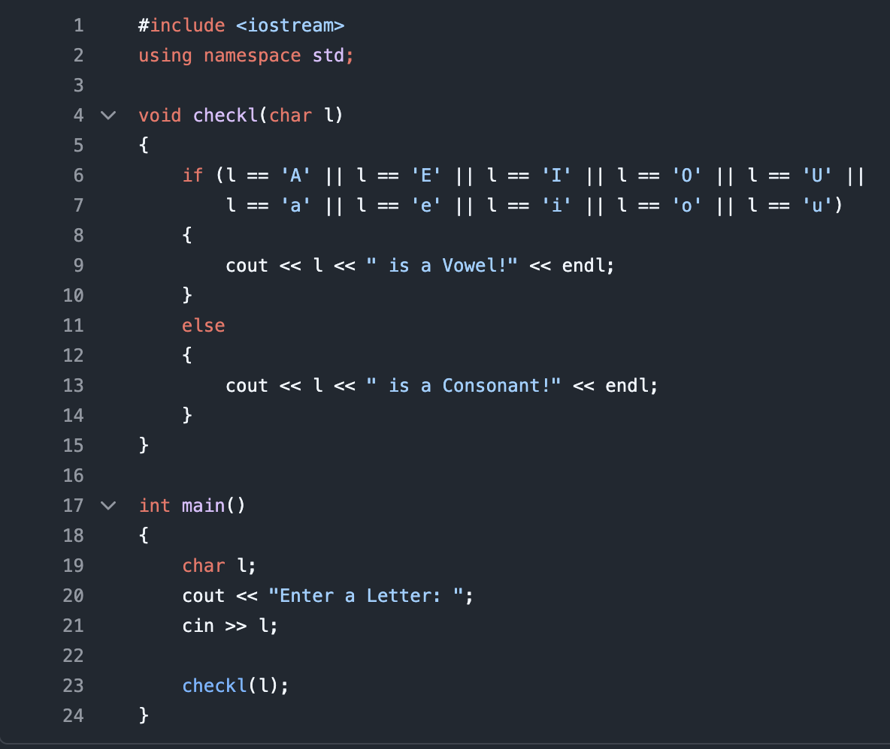
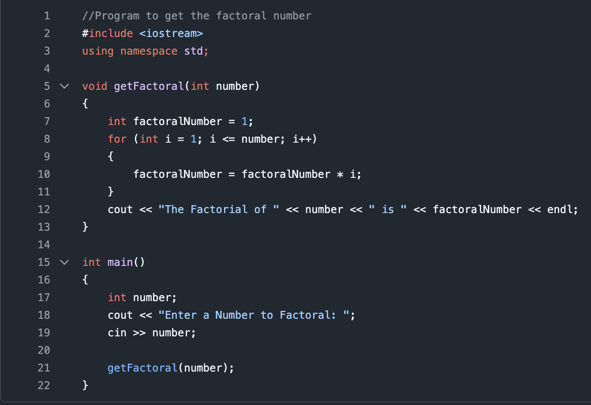

# 100 Program Challenge

This is where I'll upload any small programs that I've coded. 

These programs are meant to be bite-sized to keep my mind moving as I wait until school starts again.

These program ideas are found online. I find something that sounds appealing and code that.

# Currently at 12/100!
