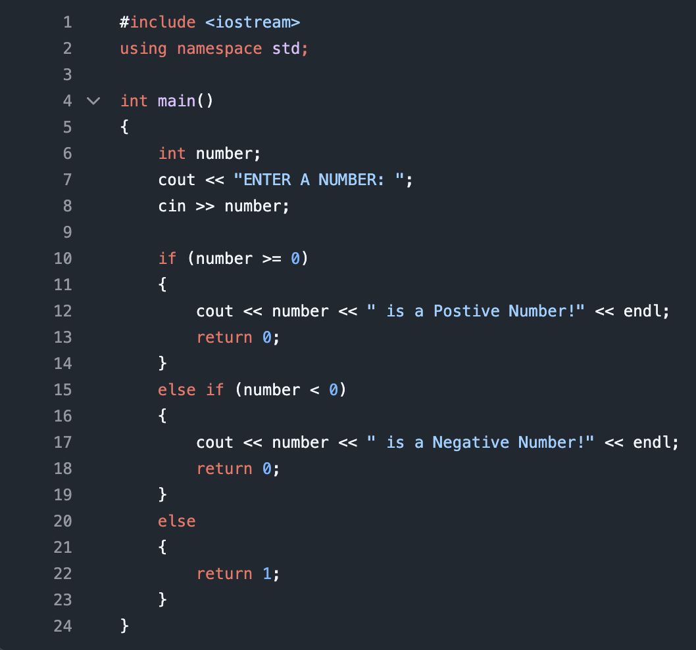
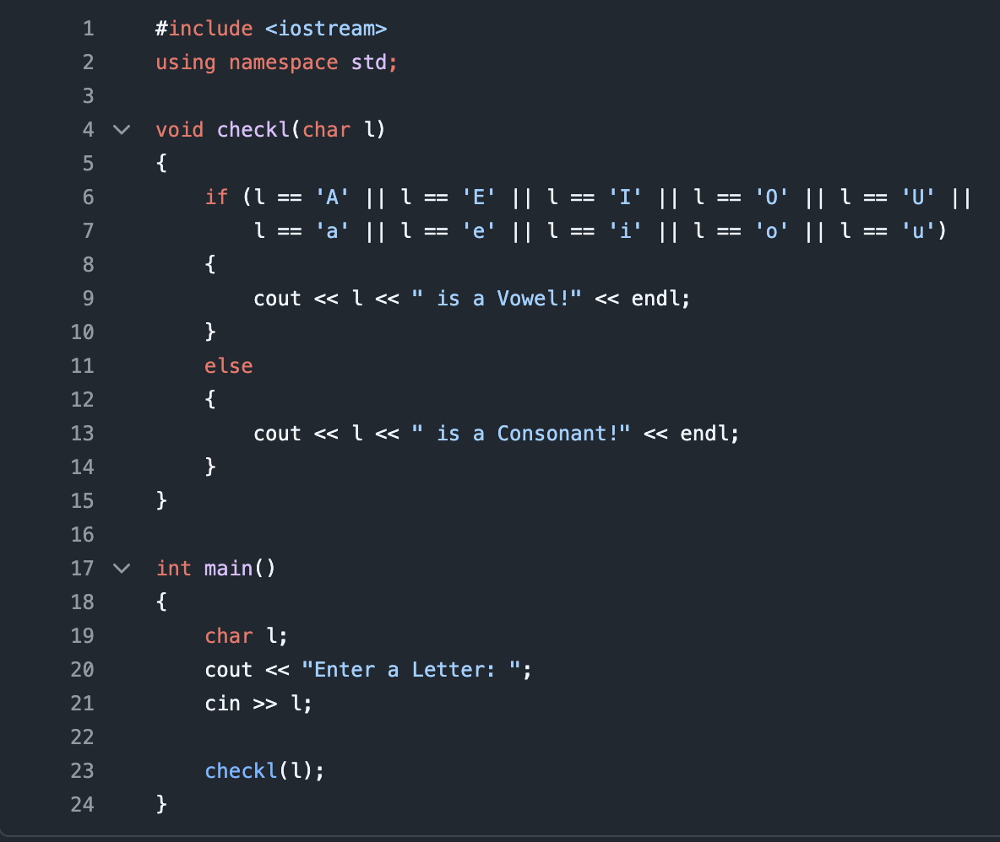
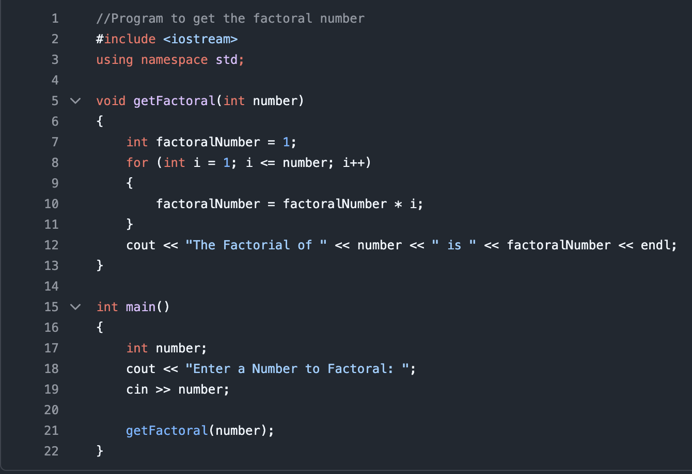

# 100 Program Challenge - Summary

Hello,

This repository serves as a platform for me to share any small programs that I have developed.

The C++ programs I upload are designed as concise coding challenges to stimulate my mental engagement during periods of non-academic activity. These challenges are reminiscent of LeetCode-style programs that can be accessed online. I identify a problem that piques my interest and proceed to code it.

The program that required the most time and effort to develop was program #12. In this program, I was tasked with calculating the factorial of a given number. At the time, I possessed limited knowledge of recursion functions and encountered significant difficulties in finding an effective solution. After researching more on recursion, I successfully implemented a correct algorithm to compute the factorial of any number. This program holds a special place in my memory as it represents my most memorable beginner program.

## Currently at 12/100!
